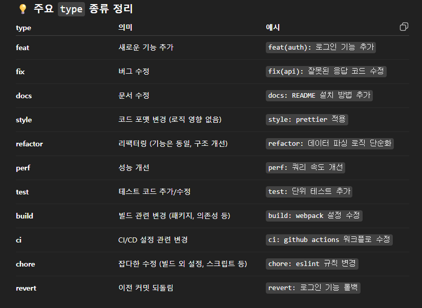

# cshapPuzzleBubble

VERSION=v2025.10.28-1

서버 스터디 와 출시를 목표로
2025-10-28 일
 - 김민수
   - 서버 강의 23강까지 읽기  
 - 김용우
   - unity 개발 환경 셋팅 하기

  - Client
   - google proto buffer
    https://protobuf.dev/getting-started/csharptutorial/
    https://github.com/protocolbuffers/protobuf/releases/tag/v33.0
    protoc-33.0-win64.zip

[[Google protocol buffer]]

[[git message 컨벤션]]

2025-11-04 일

 김민수
   - node.js 의 이벤트 드리븐이란?
     - 왜 1 thread 로 많은 동접을 받을수 있었나?
     - 그리고 1 thread 에서 어떤 행동을 하면 전체적으로 느려지나?
   - 강좌 50 강까지

  김용우
    - 유니티에 버블코드 이식
     

  

